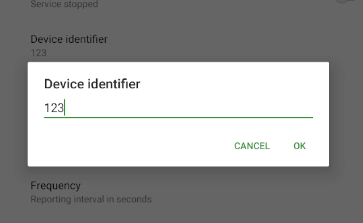
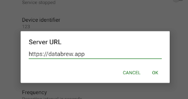
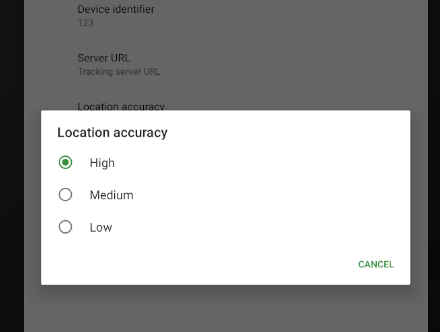
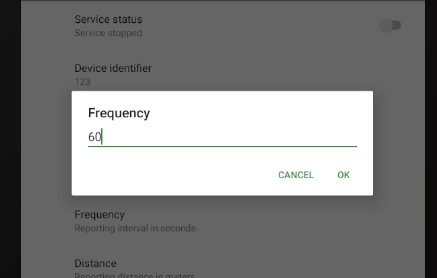

# Deploy BCV with databrew

## Caveat

- **Important**: If you are reading this guide, it's because you are already in contact with [Databrew LLC](info@databrew.cc) and we are working together on deploying a system for tracking the locations of HCWs at your facility.
- If this is not the case, you should either (a) [contact us](info@databrew.cc) to solicit assistance or (b) refer to the [IT guide](it_guide.md) for instructions on how to set up this system on your own.

# Set-up

### 1. Register your participation

- Before you install anything, we need to know who you are and that you are participating.
- Every participating HCW should go to the [REGISTRATION PAGE](https://datacat.cc/bcv) and fill out the form
- The form will generate an ID number for you. **Important**: take note of this number. You will need it in the next step.

### 2. Install the phone application

- *ANDROID*: Install Traccar client via the [Google Play Store](https://play.google.com/store/apps/details?id=org.traccar.client)
- *APPLE*:Install Traccar client via the [Apple App Store](https://apps.apple.com/us/app/traccar-client/id843156974)

### 3. Configuration

- On the phone, make sure location (in settings > privacy) is enabled, AND that the locating method is as high as possible (GPS and Wi-Fi).

- Open the Traccar app

- Set the Device Identifier to _your Identification number_ (see the "Registration" section above to get a device ID)

- Set the address of the server URL: `https://databrew.app`

- Set location accuracy to: `high`

- Set the Frequency field to: `60`

- Do not change the Distance or Angles fields

- At the top set "Service status" to on/running

- You're all done. To check that everything is working, you can click on "status". It should say "Location update". If it says "Send failed", double check your configuration parameters.

### 4. Use

- The Traccar app should be running ("Service status" set to on) at all times during operations
- The app will automatically initialize upon device reboot
- If for some reason the app is turned off, please turn it back on
- We have tested the app on many devices. At the 60 second recording interval, it has only minimal effect on battery life.
- When the device is offline, GPS coordinates are stored locally; when an internet connection is found, GPS coordinates are sent to the server.

# Reporting a case

- Go to https://datacat.cc/bcv
- In the bottom right, click "Report case"
- After a few minutes, you will receive an email report

