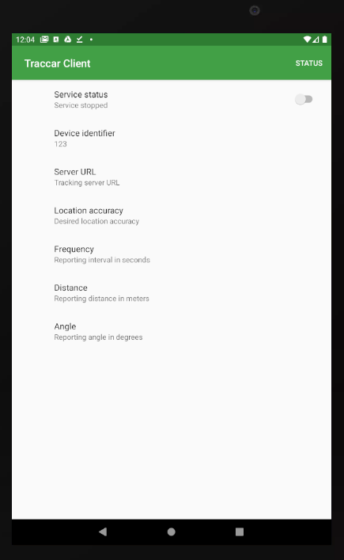
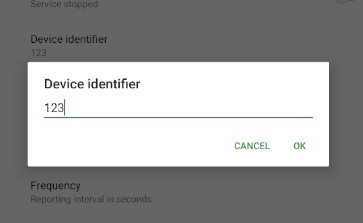
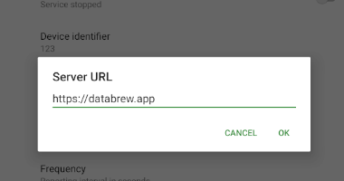
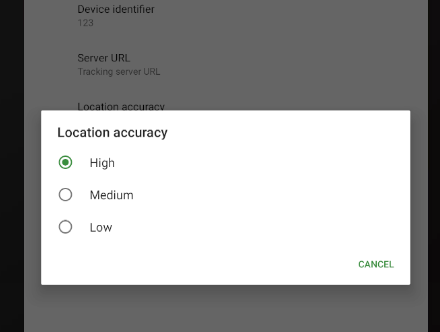
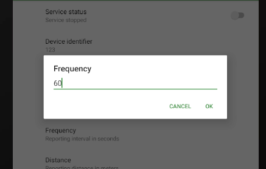
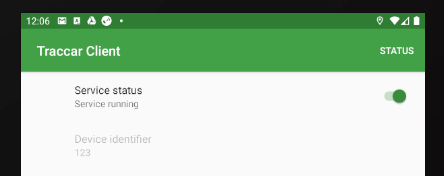

# Deploy BCV with databrew

## Consideración

- **Importante**: Si está leyendo esta guía, es porque ya está en contacto con [Databrew LLC](info@databrew.cc) y estamos trabajando juntos en la implementación de un sistema para rastrear las ubicaciones de los TS en sus instalaciones.
- Si este no es el caso, debe (a) [contactarnos] (info@databrew.cc) para solicitar asistencia o (b) consultar la [guía de IT] (it_guide.md) para obtener instrucciones sobre cómo configurar este sistema por su cuenta.

# Configurando el sistema

### 1. Registra tu participación

- Antes de instalar cualquier cosa, necesitamos saber quién es usted y si está participando.
- Cada TS participante debe ir a la [PÁGINA DE REGISTRO] (https://datacat.cc/bcv) y completar el formulario
- El formulario generará un número de identificación para usted. **Importante**: tome nota de este número. Lo necesitará en el siguiente paso.

### 2. Instalación

- *ANDROID*: Instala Traccar client via [Google Play Store](https://play.google.com/store/apps/details?id=org.traccar.client)
- *APPLE*: Instala Traccar client via [Apple App Store](https://apps.apple.com/us/app/traccar-client/id843156974)

### 3. Configuración

- En el teléfono, asegúrese de que la ubicación (en configuración> privacidad) esté habilitada, Y que el método de localización sea lo más alto posible (GPS y Wi-Fi)

- Abra la aplicación Traccar

- Configure el Identificador de dispositivo en _your Identification number_ (consulte la sección "Registro" más arriba para obtener una ID de dispositivo)

- Establezca la dirección de la URL del servidor: `https://databrew.app`

- Establezca la precisión de la ubicación en: `high`

- Establezca el campo Frecuencia a: `60`

- No cambie los campos Distancia o Ángulos

- En la parte superior establezca "Estado del servicio" en on/running

- Ya está. Para verificar que todo está funcionando bien, puedes hacer click en "status". Debe mostrar mensajes que dicen "location update"; si dice "Send failed", vuelve a verificar los parámeteros de configuración.

### 4. Utilizar

- La aplicación Traccar debe estar ejecutándose ("Estado del servicio" activado) en todo momento durante las operaciones
- La aplicación se iniciará automáticamente al reiniciar el dispositivo
- Si por alguna razón la aplicación está apagada, vuelva a encenderla
- Hemos probado la aplicación en muchos dispositivos. En el intervalo de grabación de 60 segundos, solo tiene un efecto mínimo en la duración de la batería.
- Cuando el dispositivo está fuera de cobertura, las coordenadas GPS se almacenan localmente; Cuando se encuentra una conexión a Internet, las coordenadas GPS se envían al servidor.

# Informar sobre un caso

- Vaya a https://datacat.cc/bcv
- En la parte inferior derecha, haz clic en "Informar caso"
- Después de unos minutos, recibirá un informe por correo electrónico.

