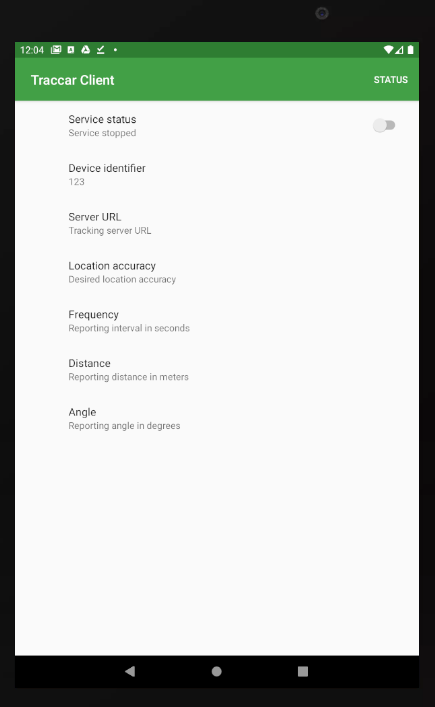

[ESTA PÁGINA EN ESPAÑOL](phone_documentation_es.md)

### 1. Registration

- Before you install anything, we need to know who you are and that you are participating.
- Please go to [REGISTRATION PAGE](https://datacat.cc/bcv) and fill out the form
- Please take note of the ID number you are assigned. You will need to put this into your phone (next step).

### 2. Installation

- *ANDROID*: Install Traccar client via the [Google Play Store](https://play.google.com/store/apps/details?id=org.traccar.client)
- *APPLE*:Install Traccar client via the [Apple App Store](https://apps.apple.com/us/app/traccar-client/id843156974)

### 3. Configuration

- On the phone, make sure location (in settings > privacy) is enabled, AND that the locating method is as high as possible (GPS and Wi-Fi).
- Open the Traccar app
- Set the Device Identifier to _your Identification number_ (see the "Registration" section above to get a device ID)

- Set the address of the server URL: `https://databrew.app`
- Set the Frequency field to: `60`
- Set location accuracy to: `high`
- Do not change the Distance or Angles fields
- At the top set "Service status" to on/running

### 4. Use

- The Traccar app should be running ("Service status" set to on) at all times during operations
- The app will automatically initialize upon device reboot
- If for some reason the app is turned off, please turn it back on
- We have tested the app on many devices. At the 60 second recording interval, it has only minimal effect on battery life.
- When the device is offline, GPS coordinates are stored locally; when an internet connection is found, GPS coordinates are sent to the server.
